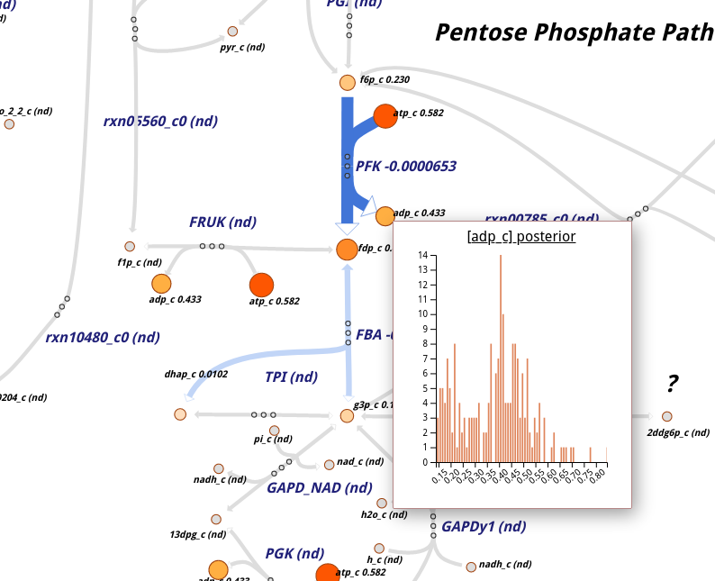

escher_maud
===========

Integrate maud_ posterior distributions into escher_.

Installation
------------

Install it with pip_:

.. code-block:: bash

  pip install git+https://github.com/carrascomj/escher_maud.git

or from source (poetry_ is recommended):

.. code-block:: bash

  git clone https://github.com/carrascomj/escher_maud
  cd escher_maud
  pip install .

Both will install a simple command line utility:

.. code-block::

  Usage: escher_maud [OPTIONS] OUTPUT_MAUD ESCHER_JSON
                   OUTPUT_HTML

    Generate standalone escher map with maud posteriors in the
    tooltip.

    The path to a maud output directory generated with `maud
    sample` OUTPUT_MAUD is applied to a json escher map
    ESCHER_JSON to compute an html of name OUTPUT_HTML.

  Options:
    --help  Show this message and exit.

.. _maud: https://github.com/biosustain/Maud 
.. _escher: https://escher.github.io/
.. _pip: https://pip.pypa.io/en/stable/
.. _poetry: https://python-poetry.org/

